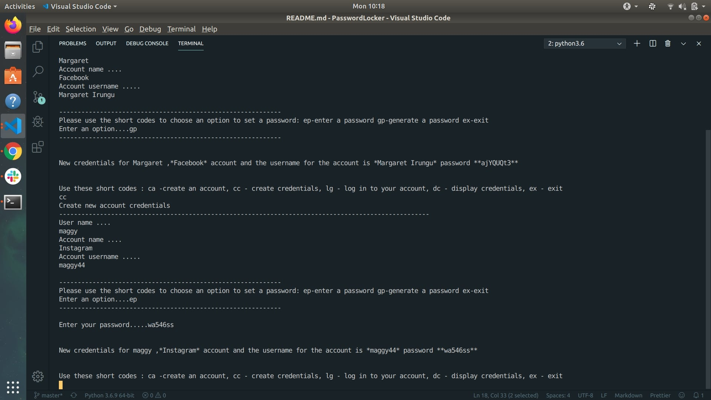

# PROJECT NAME

* PasswordLocker

## AUTHOR
* Irungu Margaret

## CODEBEAT badge

### DESCRIPTION
* On Average, a person has at least 7 different accounts he or she has signed into, be it email, social media, entertainment or job portal accounts. It becomes really hard to remember all those passwords and even create new ones.This is  an amaizing application that will help us manage our passwords and even generate new passwords for us.
 ### SET UP INSTRUCTIONS
 
#### TECHNOLOGIES USED
* Python

#### BDD
* This is  an amaizing application that will help us manage our passwords and even generate new passwords for us.

#### SUPPORT & COLLABORATION
* To anyone who would like to add a feature to th site, kindly clone the site  and further contact me on the permission to merge your changes.

##### CONTACTS info
* Email : sairzmargaret44@gmail.com
* +254 708152764

##### LICENSE info
 * - Licensed under the  [MIT license](LICENSE).
